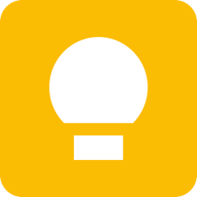

<div align="center">



# Google Keep Desktop

Traga o Google Keep para a sua área de trabalho com uma experiência nativa usando Electron.

[](https://www.electronjs.org/)
[](./LICENSE)
[](#)

</div>

---

## ✨ Recursos

- **Ícone na barra do sistema (Tray)**: acesso rápido para mostrar/ocultar
- **Login compatível**: User-Agent de navegador real para evitar bloqueios
- **Atalhos rápidos**: F5 / Ctrl+R para recarregar
- **Build simples**: instaladores com Electron Forge
- **Multi-plataforma**: macOS e Windows

> Observação: Este app é um wrapper do site oficial do Google Keep (`https://keep.google.com`).

---

## 📦 Pré-requisitos

- Node.js 18+ (recomendado via Homebrew no macOS)
- npm 9+ (vem com o Node)

macOS (Homebrew):

```bash
brew install node
```

Windows:
- Instale o Node pelo site oficial `https://nodejs.org/` ou via `nvm-windows`.

---

## 🚀 Desenvolvimento

1. Instale as dependências:

```bash
npm ci
```

2. Inicie o app em desenvolvimento:

```bash
npm start
```

O aplicativo abrirá uma janela do Google Keep. O ícone ficará disponível na área de notificação (Windows) ou barra de menus (macOS).

---

## 🏗️ Build (Instalador)

- macOS/Linux:

```bash
rm -rf out && npm run make
```

- Windows (PowerShell):

```powershell
Remove-Item -Path 'out' -Recurse -Force -ErrorAction SilentlyContinue; npm run make
```

Os artefatos ficam em `out/`.

---

## ⚙️ Configuração do Tray (macOS)

- O app tenta usar, nesta ordem, `icone-macos.jpg`, `icon-macos.jpg` e por fim `icon.png`.
- Tamanho aplicado: 16x16 para manter nitidez na barra do macOS.
- Se preferir um outro ícone, coloque o arquivo na raiz com um desses nomes e reinicie o app.

> Dica: Para ícones monocromáticos no macOS, forneça uma imagem com fundo transparente e alta resolução.

---

## 🧰 Scripts úteis

- `npm start`: inicia em desenvolvimento
- `npm run make`: gera instaladores com Electron Forge

No VS Code, há tarefas prontas em `.vscode/tasks.json`:
- "Executar Electron (Dev)"
- "Limpar e Gerar Executável" (cross-platform)

---

## 🐞 Solução de problemas

- Mensagens sobre certificados no macOS (Chromium) são comuns e não bloqueiam o app.
- Se o `npm` não for encontrado no macOS, instale via Homebrew: `brew install node`.
- Se o ícone do Tray ficar distorcido, ajuste a arte (16x16 ou 32x32 para Retina) e reinicie.

---

## 🔒 Aviso

Google Keep é uma marca do Google LLC. Este projeto é não-oficial e apenas fornece um wrapper desktop para o serviço web.

---

## 📸 Screenshots

<div align="center">
  
</div>

---

## 📄 Licença

Distribuído sob a licença MIT. Veja `LICENSE` para mais informações.
