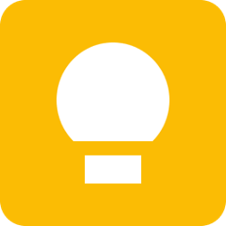

<div align="center">
  

  <h1>Google Keep Desktop</h1>

  <p><strong>O Google Keep numa janela de verdade, fora do navegador.</strong></p>
  <p>Um app de desktop multiplataforma que vive na barra/bandeja do sistema — clique e suas notas aparecem, clique de novo e somem.</p>

  <p>
    
    
    
    
    
  </p>
</div>

---

<p align="center">
  
</p>

---

## 🧭 O problema

O Google Keep só existe como aba de navegador. Toda vez que você quer anotar algo rápido, precisa achar a aba perdida entre dezenas de outras, ou abrir o navegador do zero. Não tem ícone próprio na bandeja, some quando você fecha o navegador, e disputa memória e atenção com tudo o que está aberto junto. Pra uma ferramenta que serve justamente pra capturar ideias no susto, isso é fricção demais.

## ✨ A solução

Google Keep Desktop empacota o `keep.google.com` numa janela Electron dedicada que mora na **bandeja do sistema** (tray no Windows/Linux, barra de menus no macOS). Um clique no ícone mostra ou esconde as notas — sem caçar aba, sem abrir navegador. Fechar ou minimizar não mata o app: ele recolhe pra bandeja e continua a um clique de distância. Por baixo é o Keep oficial de verdade, com seu login e sincronização normais.

## 🎯 Features

- 🗂️ **Ícone na bandeja do sistema** — clique pra mostrar/esconder a janela das notas
- 🪟 **Janela dedicada** — 1200×800, sem menu nativo do Electron poluindo a tela
- 🙈 **Esconde em vez de fechar** — fechar ou minimizar recolhe pra bandeja, o app segue rodando
- 🔑 **Login que funciona** — User-Agent de Chrome real pra o login do Google não barrar a janela
- 🔄 **Recarregar rápido** — `F5` ou `Ctrl+R`, ou pelo menu da bandeja
- 🚫 **Sem ícone na barra de tarefas** — vive só na bandeja (`skipTaskbar`)
- 📦 **Instaladores nativos** — Squirrel (Windows), ZIP universal (macOS x64+arm64), `.deb` e `.rpm` (Linux) via Electron Forge

> **Observação:** este app é um wrapper do site oficial do Google Keep (`https://keep.google.com`). Não há reimplementação das notas — é o Keep de verdade dentro de uma janela própria.

## 📦 Instalação

Baixe o instalador da sua plataforma na página de [Releases](https://github.com/fredwilliamtjr/google-keep-desktop/releases):

- **Windows** — rode o `Google Keep Desktop Setup.exe` (cria atalhos na área de trabalho e no menu Iniciar)
- **macOS** — descompacte o `.zip` e arraste o `Google Keep Desktop.app` pra pasta **Applications**
- **Linux** — instale o `.deb` (`sudo dpkg -i ...`) ou o `.rpm` (`sudo rpm -i ...`)

> No macOS, na primeira abertura clique com **botão direito → Abrir** caso o Gatekeeper reclame (o app não é assinado com Developer ID).

## ⚙️ Como usar

1. Abra o app — uma janela do Google Keep aparece e um ícone surge na bandeja do sistema
2. Faça login na sua conta Google normalmente
3. **Clique no ícone da bandeja** pra mostrar/esconder a janela a qualquer momento
4. Fechar ou minimizar a janela **não encerra** o app — ele recolhe pra bandeja

Menu de contexto da bandeja (clique com o botão direito no ícone):

| Item | Ação |
|---|---|
| **Mostrar Google Keep** | Traz a janela pra frente |
| **Esconder** | Recolhe a janela pra bandeja |
| **Recarregar** | Recarrega o Keep (equivale a `F5` / `Ctrl+R`) |
| **Sair** | Encerra o app de vez |

## 🧱 Arquitetura

```
google-keep-desktop/
├── main.js              # Processo principal: janela, tray e ciclo de vida do app
├── forge.config.js      # Electron Forge — makers (Squirrel/ZIP/deb/rpm) + fuses
├── package.json         # Metadados, scripts e dependências
├── icon.{png,ico,icns}  # Ícones por plataforma
├── icone-macos.jpg      # Ícone colorido 16×16 da barra de menus (macOS)
└── .vscode/tasks.json   # Tarefas prontas de dev e build
```

| Componente | Responsabilidade |
|---|---|
| `createWindow()` | Cria a `BrowserWindow` 1200×800, carrega `keep.google.com`, injeta o User-Agent de Chrome, intercepta `F5`/`Ctrl+R` e converte fechar/minimizar em "esconder" |
| `createTray()` | Monta o `Tray` com menu de contexto (Mostrar/Esconder/Recarregar/Sair) e toggle ao clicar; no macOS escolhe `icone-macos.jpg` → `icon-macos.jpg` → `icon.png` e redimensiona pra 16×16 |
| Ciclo de vida | Handlers de `before-quit`/`will-quit`/`quit` + sinais (`SIGINT`/`SIGTERM`) garantem que tray e janela sejam destruídos e o processo encerre limpo |
| `FusesPlugin` | Endurece o binário em tempo de empacotamento (sem `RunAsNode`, só carrega do ASAR, valida integridade) |

## 🔨 Build a partir do código

Requisitos:
- Node.js 18+ (no macOS, recomendado via `brew install node`)
- npm 9+ (vem com o Node)

```bash
git clone https://github.com/fredwilliamtjr/google-keep-desktop.git
cd google-keep-desktop
npm ci
```

Rodar em desenvolvimento:

```bash
npm start
```

### Gerar os instaladores

```bash
# macOS / Linux
rm -rf out && npm run make
```

```powershell
# Windows (PowerShell)
Remove-Item -Path 'out' -Recurse -Force -ErrorAction SilentlyContinue; npm run make
```

Os artefatos ficam em `out/`. No macOS o `make` gera binário universal (`x64` + `arm64`) automaticamente.

> No VS Code há tarefas prontas em `.vscode/tasks.json`: **"Executar Electron (Dev)"** e **"Limpar e Gerar Executável"**.

### Trocar o ícone da bandeja (macOS)

O app procura, nesta ordem: `icone-macos.jpg` → `icon-macos.jpg` → `icon.png`. Coloque seu arquivo na raiz com um desses nomes (transparente e em alta resolução pra ficar nítido a 16×16) e reinicie.

## 🔒 Segurança / Aviso

- **Hardening via Fuses**: `RunAsNode` desligado, `OnlyLoadAppFromAsar` e validação de integridade do ASAR ligados.
- **Sem credenciais armazenadas pelo app**: todo login e sincronização acontecem dentro da sessão do próprio Google Keep — o wrapper não intercepta nem guarda nada.
- **Assinatura**: não assinado por padrão. Pra distribuição sem fricção, macOS precisaria de Developer ID + notarização e Windows de um certificado de code signing.
- **Marca registrada**: Google Keep é uma marca do Google LLC. Este é um projeto **não-oficial** que apenas fornece um wrapper desktop para o serviço web.

## 🗺️ Roadmap

- [x] Janela dedicada + ícone na bandeja com mostrar/esconder
- [x] Login funcional via User-Agent de Chrome
- [x] Esconder em vez de fechar + encerramento limpo
- [x] Instaladores para Windows, macOS e Linux via Electron Forge
- [ ] Atalho global de teclado pra mostrar/esconder a janela
- [ ] Badge de notificações no ícone da bandeja
- [ ] Iniciar com o sistema (login item)
- [ ] Code signing + notarização (distribuir sem aviso do SO)
- [ ] Arquivo `LICENSE` no repositório

## 📄 Licença

Distribuído sob a licença **MIT**.

---

<div align="center">
  <sub>Feito com ☕ por <a href="https://github.com/fredwilliamtjr">@fredwilliamtjr</a></sub>
</div>
